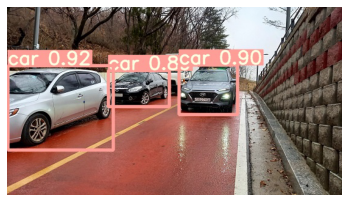

# AI_vehicleDetection

```python
import os
from glob import glob
import numpy as np
import matplotlib.pyplot as plt
import cv2
```


```python
#roboflow에서 차량데이터셋 확보 
#!curl -L "https://public.roboflow.com/ds/Ehl0H4BSei?key=7CVzde0fk1" > roboflow.zip; unzip roboflow.zip; rm roboflow.zip
```


```python
#데이터셋을 train,validation으로 분리
img_list = sorted(glob('/workspace/ssddata/car_dataset/dataset/export/images/*.jpg'))

from sklearn.model_selection import train_test_split

train_img_list , val_img_list = train_test_split(img_list,test_size=0.2,random_state=2000)
```


```python
#Train
```


```python
#!python detect.py --weight /workspace/Docker/yolov5_car/yolov5/runs/train/yolov5_car/weights/best.pt --source '/workspace/ssddata/yolov5_car_dataset/test_dataset/test_v.mp4'
```


```python
result_img = glob('/workspace/Docker/ex/*.jpg')
```


```python
img = np.random.choice(result_img)
img = plt.imread(img)
plt.axis('off')
plt.imshow(img)
plt.show()
```

    

    


```python

```
